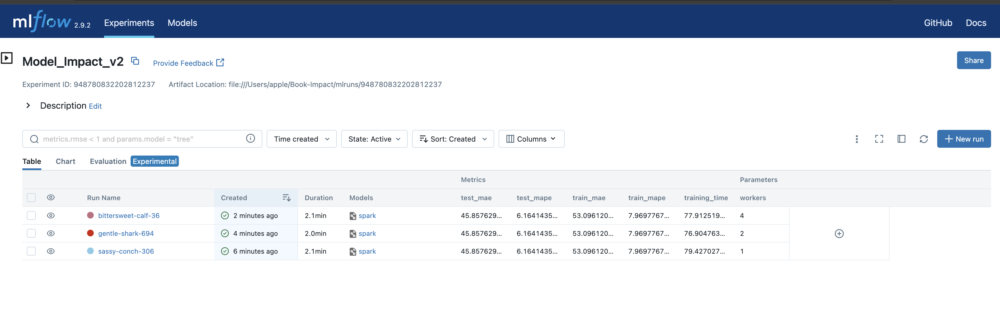

# Book Impact Predection using Spark

## Overview

This Repo covers end to end approach of building a book impact predicition model using RandomForest and Pyspark

## Table of Contents


- [Book Impact Predection using Spark](#book-impact-predection-using-spark)
  - [Overview](#overview)
  - [Table of Contents](#table-of-contents)
  - [Requirements](#requirements)
  - [Setup Instructions](#setup-instructions)
  - [Jupyter Notebooks](#jupyter-notebooks)
  - [Virtual Environment](#virtual-environment)
  - [Running the Code](#running-the-code)
  - [MLflow](#mlflow)
  - [Model  Results](#model--results)
  - [](#)

## Requirements


- Apache Spark (Pyspark)
- Python 3.x
- Anaconda(Jupyter)
- Other dependencies...

## Setup Instructions

This Repo needs Spark Setup Locally incase you do not have it refer  to links below to setup Spark

1. Installing Spark on Mac [Guide](https://sparkbyexamples.com/pyspark/how-to-install-pyspark-on-mac/)

2. Installing Spark on Windows [Guide](https://sparkbyexamples.com/pyspark/how-to-install-and-run-pyspark-on-windows/)


## Jupyter Notebooks


- **Feature_Engineering.ipynb**: This covers Exploratory Analysis and Featur Engineering using Pyspark [details](./FeatureEgineering.md)

- **Modeling.ipynb**: This convers Model Data  Preperation and Model Training and Evaluation [details](./model_building.md)

## Virtual Environment

Setup a Virtual Enviornment with all necessarty dependencies

To set up a virtual environment, use the following commands (assuming you have Python 3 installed):

```bash
# Create a virtual environment (replace 'myenv' with your preferred name)
python3 -m venv env

# Activate the virtual environment
source env/bin/activate  # On Windows, use 'myenv\Scripts\activate'
```

## Running the Code

Provide step-by-step instructions on how to run your code within the virtual environment.

```bash
# Install project dependencies
pip install -r requirements.txt

# Start Jupyter Notebook
jupyter notebook

# Open and run the notebooks in the Jupyter interface.
```

## MLflow

Tracking Model Training and Evaluation using MLFlow

1. Start the MLflow server:

```bash
mlflow server --port 5000
```

3. Access the MLflow UI by opening a web browser and navigating to `http://localhost:5000`. Here, you can view and manage your experiments, models, and results.

## Model  Results


---
